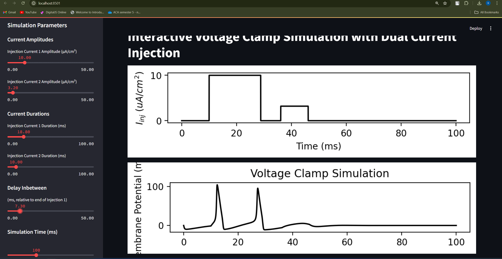

# hodgkin-huxley




## Overview

This repository contains a Streamlit-based webapps and jupyter notebooks of Hodgkin and Huxley model.

To run this application locally, follow these steps:

### To run the webapps

Make sure you have Python installed. This project requires the following Python libraries:

```bash
  pip install streamlit numpy matplotlib scipy
```
Then navigate to the webapps folder and run 
```bash
  streamlit run .\vclampstreamlit.py
```
